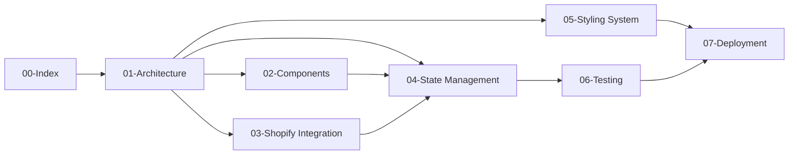

# Documentation Index

Welcome to the House of Mornii Shop application documentation. This documentation set provides comprehensive coverage of the architecture, components, integrations, and operational procedures for this React e-commerce storefront.

## Quick Links

| Document | Description |
|----------|-------------|
| [01 - Architecture](./01-architecture.md) | Application architecture, tech stack, data flow, directory structure |
| [02 - Components](./02-components.md) | Complete component library with props, purposes, and relationships |
| [03 - Shopify Integration](./03-shopify-integration.md) | Storefront API integration, modes, queries, mutations |
| [04 - State Management](./04-state-management.md) | CartContext, TanStack Query, localStorage patterns |
| [05 - Styling System](./05-styling-system.md) | Tailwind CSS 4, design tokens, OKLCH colors, animations |
| [06 - Testing](./06-testing.md) | Vitest setup, Playwright E2E, testing patterns |
| [07 - Deployment](./07-deployment.md) | Environment variables, Cloudflare Pages, CI/CD |

## Documentation Structure

## Reading Order Recommendations

### For New Contributors

1. **[01 - Architecture](./01-architecture.md)** - Understand the tech stack and project structure
2. **[02 - Components](./02-components.md)** - Learn the component library
3. **[07 - Deployment](./07-deployment.md)** - Set up local development environment

### For Shopify Integration Work

1. **[03 - Shopify Integration](./03-shopify-integration.md)** - API modes, queries, mutations
2. **[04 - State Management](./04-state-management.md)** - Cart persistence patterns
3. **[02 - Components](./02-components.md)** - Product and cart components

### For UI/Design Work

1. **[05 - Styling System](./05-styling-system.md)** - Tailwind, OKLCH colors, animations
2. **[02 - Components](./02-components.md)** - Component API reference
3. **[GOLDEN_GLOW_GUIDE.md](../GOLDEN_GLOW_GUIDE.md)** - Golden glow system details

### For DevOps/Deployment

1. **[07 - Deployment](./07-deployment.md)** - Environment setup, Cloudflare Pages
2. **[06 - Testing](./06-testing.md)** - CI pipeline, test configuration
3. **[.env.example](../.env.example)** - Complete environment variable reference

## Related Documents (Outside This Folder)

| File | Purpose |
|------|---------|
| [`../README.md`](../README.md) | Project overview and quick start |
| [`../PRD.md`](../PRD.md) | Product requirements and design direction |
| [`../GOLDEN_GLOW_GUIDE.md`](../GOLDEN_GLOW_GUIDE.md) | Golden glow under-lighting system guide |
| [`../SHOPIFY_STOREFRONT_API.md`](./SHOPIFY_STOREFRONT_API.md) | Shopify API reference (legacy) |
| [`../.env.example`](../.env.example) | Environment variable templates |
| [`../AGENTS.md`](../AGENTS.md) | Repository rules and conventions |

## Existing Architecture Documents

Additional research and planning documents are available in the `docs/` subdirectory:

| Document | Topic |
|----------|-------|
| [architecture-reviews/shopify-storefront-status-2026-04-10.md](./architecture-reviews/shopify-storefront-status-2026-04-10.md) | Shopify integration audit |
| [cloudflare-pages-ci-strategy.md](./cloudflare-pages-ci-strategy.md) | CI/CD strategy for Cloudflare |
| [deployment-runbook.md](./deployment-runbook.md) | Detailed deployment procedures |
| [error-handling-architecture.md](./error-handling-architecture.md) | Error handling patterns |
| [newsletter-integration-guide.md](./newsletter-integration-guide.md) | Newsletter provider integration |
| [production-launch-checklist.md](./production-launch-checklist.md) | Pre-launch verification steps |
| [shopify-admin-reference.md](./shopify-admin-reference.md) | Shopify admin setup guide |
| [shopify-auth-mode-setup.md](./shopify-auth-mode-setup.md) | Authentication configuration |
| [shopify-dev-store-audit.md](./shopify-dev-store-audit.md) | Development store audit checklist |
| [shopify-error-handling-guide.md](./shopify-error-handling-guide.md) | Shopify-specific error handling |
| [status-report-2026-04-26.md](./status-report-2026-04-26.md) | Project status report |

## Key Concepts Summary

### Three Operational Modes

| Mode | Credentials | Data Source |
|------|-------------|-------------|
| Demo | None | Fixture data |
| Tokenless | Domain only | Limited Shopify fields |
| Token | Domain + token | Full Shopify API |

### State Management Layers

1. **Server state** - TanStack Query (products, collections)
2. **Client state** - React Context (cart, theme)
3. **Persistent state** - localStorage/sessionStorage (cart ID, theme preference)

### Styling Architecture

- Tailwind CSS 4 with `@tailwindcss/vite` plugin (no PostCSS)
- SCSS mixins for complex patterns (`ornamental-surface`)
- CSS custom properties for theming (dark/light mode)
- OKLCH color space for perceptually uniform colors
- Framer Motion for animations with `luxuryEase` easing

### Testing Strategy

- **Vitest** - Unit and integration tests (jsdom environment)
- **Playwright** - End-to-end browser tests (Chromium)
- **Manual** - Visual/design validation
