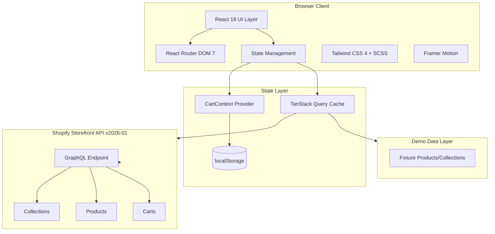
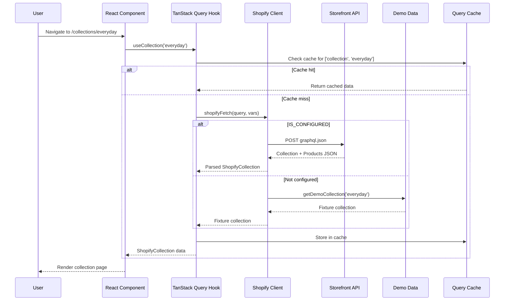

# Application Architecture

## Overview

House of Mornii Shop is a luxury e-commerce storefront for a heritage-inspired jewelry brand. The application combines a static-site-like development experience with dynamic Shopify integration, supporting three operational modes that allow full functionality from prototype to production.



## Tech Stack

| Category | Technology | Version | Purpose |
|----------|------------|---------|---------|
| Framework | React | 19.0.0 | UI component library |
| Language | TypeScript | 5.7.2 | Type safety and developer experience |
| Build Tool | Vite | 7.2.6 | Fast dev server and production bundling |
| Routing | React Router DOM | 7.13.0 | Client-side routing with lazy loading |
| Data Fetching | TanStack Query | 5.83.1 | Server state caching and synchronization |
| Styling | Tailwind CSS | 4.1.11 | Utility-first CSS framework |
| Preprocessor | SCSS | 1.97.3 | CSS preprocessing with mixins |
| Animations | Framer Motion | 12.6.2 | Declarative animation library |
| UI Primitives | Radix UI | Latest | Headless accessible components |
| Form Handling | React Hook Form | 7.54.2 | Performant form validation |
| Validation | Zod | 3.25.76 | Schema validation |
| Toast Notifications | Sonner | 2.0.7 | Lightweight toast system |
| Testing | Vitest | 4.0.18 | Unit/integration testing |
| E2E Testing | Playwright | 1.59.1 | End-to-end browser testing |

## Directory Structure

```
src/
├── App.tsx                    # Root app component, routing setup
├── main.tsx                   # Application entry point
├── index.scss                 # Global styles, SCSS mixins, theme variables
├── tailwind.css               # Tailwind imports
├── ErrorFallback.tsx          # Error boundary fallback UI
├── assets/                    # Static assets
│   ├── images/                # Product and decorative images
│   └── ornaments/             # SVG ornamental elements
├── components/                # Application UI components
│   ├── ui/                    # Radix-wrapped shadcn-style primitives
│   ├── Header.tsx             # Fixed navigation header
│   ├── Footer.tsx             # Site footer with links
│   ├── CartFlyout.tsx         # Slide-out cart drawer
│   ├── ProductCard.tsx        # Product grid item
│   ├── JewelryImage.tsx       # Optimized product image component
│   ├── OrnamentalBorder.tsx   # Decorative border wrapper
│   └── ...                    # Other page-specific components
├── context/                   # React Context providers
│   └── CartContext.tsx        # Shopping cart state management
├── hooks/                     # Custom React hooks
│   ├── useSEO.ts              # Dynamic meta tag management
│   ├── useShopifyError.ts     # Shopify error categorization
│   ├── useTheme.ts            # Dark/light theme toggle
│   └── use-mobile.ts          # Responsive breakpoint hook
├── lib/                       # Utility libraries
│   ├── shopify/               # Shopify integration layer
│   │   ├── client.ts          # GraphQL API client + mode detection
│   │   ├── queries.ts         # GraphQL query/mutation strings
│   │   ├── types.ts           # TypeScript interfaces
│   │   ├── hooks.ts           # TanStack Query data hooks
│   │   ├── demo-data.ts       # Fixture products and collections
│   │   ├── health.ts          # API health check utilities
│   │   └── token-requirements.ts  # Token-gated field documentation
│   ├── analytics.ts           # GA4 + Meta Pixel tracking
│   ├── animations.ts          # Framer Motion animation constants
│   ├── cart.ts                # Cart utility functions
│   ├── newsletter.ts          # Newsletter subscription handler
│   ├── siteConfig.ts          # Site metadata from env vars
│   ├── logger.ts              # Structured logging utility
│   └── utils.ts               # General utilities (cn() merge)
├── pages/                     # Route-level page components
│   ├── HomePage.tsx           # Landing page with hero + collections
│   ├── ShopPage.tsx           # Full product catalog
│   ├── CollectionPage.tsx     # Single collection with products
│   ├── ProductPage.tsx        # Individual product detail
│   ├── CartPage.tsx           # Cart review and checkout
│   ├── AboutPage.tsx          # Brand story page
│   └── ContactPage.tsx        # Contact information page
├── test/                      # Test utilities
│   ├── setup.ts               # Vitest global setup
│   └── utils.tsx              # Test helpers
└── e2e/                       # Playwright E2E tests
    └── buyer-journey.spec.ts  # Full checkout flow test
```

## Data Flow



## Routing Architecture

All pages are lazy-loaded via `React.lazy()` for code splitting. Route transitions use Framer Motion's `AnimatePresence` with a blur-clearing fade-up effect.

| Route | Page Component | Description |
|-------|---------------|-------------|
| `/` | [`HomePage`](src/pages/HomePage.tsx) | Hero, mood navigator, collections showcase |
| `/shop` | [`ShopPage`](src/pages/ShopPage.tsx) | Full product catalog with sorting/search |
| `/collections` | [`CollectionsPage`](src/pages/CollectionsPage.tsx) | All collections overview |
| `/collections/:handle` | [`CollectionPage`](src/pages/CollectionPage.tsx) | Single collection with products |
| `/products/:handle` | [`ProductPage`](src/pages/ProductPage.tsx) | Product detail with variant selector |
| `/about` | [`AboutPage`](src/pages/AboutPage.tsx) | Brand story and philosophy |
| `/contact` | [`ContactPage`](src/pages/ContactPage.tsx) | Contact information and CTA |
| `/cart` | [`CartPage`](src/pages/CartPage.tsx) | Cart review and checkout redirect |

## Configuration Aliases

The `@/` path alias resolves to the `src/` directory, configured in both Vite and Vitest:

```typescript
// vite.config.ts
resolve: {
  alias: {
    '@': resolve(projectRoot, 'src')
  }
}
```

This enables clean imports throughout the codebase:

```typescript
import { useCart } from '@/context/CartContext'
import { shopifyFetch } from '@/lib/shopify/client'
import { Button } from '@/components/ui/button'
```

## Build Pipeline

```mermaid
flowchart LR
    TS[TypeScript tsc] --> Vite[Vite Build]
    Vite --> Dist[dist/ output]
    
    subgraph Guard["Build Guards"]
        Check{NODE_ENV<br>=production?}
        |-- Yes --> Creds{Credentials<br>present?}
        Creds |-- No --> Fail[Abort: exit 1]
        Creds |-- Yes --> Placeholder{Placeholder<br>domain?}
        Placeholder |-- Yes --> Fail
        Placeholder |-- No --> Vite
        |-- No --> Vite
    end
```

Production builds include a guard that aborts if Shopify credentials are missing or contain placeholder values, preventing accidental demo-mode deployments.
