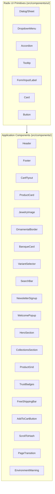

# Component Library

## Overview

The component library is organized into two tiers: application-specific UI components in `src/components/` and headless accessible primitives wrapped from Radix UI in `src/components/ui/`. All components follow a consistent pattern using Tailwind CSS for styling, Framer Motion for animations, and TypeScript for type safety.

## Component Hierarchy



## Layout Components

### [`ScrollToHash`](src/components/ScrollToHash.tsx)

Utility component that scrolls to hash fragment on page load.

**Props:** None

### [`PageTransition`](src/components/PageTransition.tsx)

Framer Motion wrapper for route transition animations.

**Props:** `children: ReactNode`

### [`EnvironmentWarning`](src/components/EnvironmentWarning.tsx)

Displays a warning banner when Shopify credentials are missing in production.

**Props:** None

### [`Header`](src/components/Header.tsx)

Fixed navigation header with glass-panel styling, responsive mobile menu, and cart badge.

**Props:** None (uses context internally)

**Key Features:**
- Fixed position at top of viewport (`z-index: 50`)
- Glass panel background with `glass-panel` class
- Responsive: desktop nav links vs. mobile Sheet drawer
- Cart badge showing item count
- Theme toggle (dark/light mode)
- Brand lockup as home link

**Navigation Links:**
| Label | Route |
|-------|-------|
| SHOP | `/shop` |
| COLLECTIONS | `/collections` |
| ABOUT | `/about` |
| CONTACT | `/contact` |

**Desktop Extra Buttons:**
- Theme toggle (dark/light)
- SearchBar (Cmd+K / Ctrl+K)
- Cart button with badge
- "BOOK A STYLING" CTA linking to `/contact`

**Mobile Menu:**
- Navigation links
- "BOOK A STYLING" button at bottom

**Usage:**
```tsx
// Rendered automatically in App.tsx
import { Header } from '@/components/Header'
```

### [`Footer`](src/components/Footer.tsx)

Site footer with brand lockup, trust badges, newsletter signup, and copyright.

**Props:** None (uses context internally)

**Key Features:**
- Ornamental divider between sections
- TrustBadges component (compact variant)
- NewsletterSignup integration
- Dynamic copyright year
- Tagline "REGAL · RADIANT · MODERN"

### [`CartFlyout`](src/components/CartFlyout.tsx)

Slide-out cart drawer (Sheet) that appears when user opens cart from any page.

**Props:** None (uses `useCart()` context internally)

**Key Features:**
- Controlled by `isCartOpen` state from CartContext
- Displays cart items with images, quantities, prices
- Debounced quantity adjustment per line item (300ms debounce)
- Remove line item functionality
- FreeShippingBar integration
- Cart subtotal display
- Checkout button linking to Shopify checkout URL (validates URL)
- Closes when clicking outside or pressing Escape

## Product Components

### [`AddToCartButton`](src/components/AddToCartButton.tsx)

Product detail page button for adding items to cart with loading states.

**Props:**
```typescript
interface AddToCartButtonProps {
  variantId: string
  availableForSale: boolean
  productTitle: string
  productPrice: string
  currencyCode?: string
  className?: string
  compact?: boolean
}
```

**Key Features:**
- Loading spinner state during add-to-cart operation
- Analytics tracking via `trackAddToCart()`
- Error handling with toast notification
- "SOLD OUT" disabled state when unavailable
- Compact mode for smaller layouts

### [`ProductCard`](src/components/ProductCard.tsx)

Interactive product card for grid display with image, title, price, and description.

**Props:**
```typescript
interface ProductCardProps {
  product: ShopifyProduct
  index?: number        // For staggered animation delay
}
```

**Key Features:**
- `React.memo` wrapped with custom comparison function to prevent unnecessary re-renders
- Framer Motion entrance animation with viewport-triggered fade-up (`once: true`)
- Discount price display (strikethrough original + accent sale price)
- Image hover zoom effect (`hover:scale-105`, `duration-700`)
- Links to `/products/:handle`
- Lazy-loaded images with fallback placeholder

**Animation:**
```tsx
<motion.div
  initial={{ opacity: 0, y: 24 }}
  whileInView={{ opacity: 1, y: 0 }}
  viewport={{ once: true, margin: '-40px' }}
  transition={{ duration: 0.6, ease: 'easeOut', delay: index * 0.12 }}
>
```

### [`ProductGrid`](src/components/ProductGrid.tsx)

Grid layout for displaying multiple product cards with responsive columns.

**Props:**
```typescript
interface ProductGridProps {
  products: ShopifyProduct[]
  className?: string
}
```

**Key Features:**
- Responsive grid (1 col mobile, 2 col tablet, 3 col desktop)
- Empty state handling ("No products found in this collection.")

### [`JewelryImage`](src/components/JewelryImage.tsx)

SVG illustration component for collection placeholders (not actual product images).

**Props:**
```typescript
interface JewelryImageProps {
  collection: 'everyday' | 'festive' | 'bridal'
  className?: string
}
```

**Key Features:**
- Renders unique SVG jewelry illustrations per collection
- Everyday: pearl pendant with gold chain
- Festive: emerald jewel with gold setting
- Bridal: multi-pearl arrangement with gold accents
- Radial gradient backgrounds specific to each collection

### [`VariantSelector`](src/components/VariantSelector.tsx)

Product variant selection UI for multi-option products.

**Props:**
```typescript
interface VariantSelectorProps {
  product: ShopifyProduct
  selectedVariant: ShopifyProductVariant | null
  onVariantChange: (variant: ShopifyProductVariant) => void
}
```

**Key Features:**
- Renders option groups (e.g., Color, Size) as text buttons
- Disabled state for unavailable variants (opacity + line-through)
- Selected state highlighting with accent border
- Returns null when only one variant exists

## Decorative Components

### [`OrnamentalBorder`](src/components/OrnamentalBorder.tsx)

Decorative wrapper component applying golden under-glow and ornamental styling.

**Props:**
```typescript
interface OrnamentalBorderProps {
  children: ReactNode
  className?: string
  noGlow?: boolean          // Disable golden glow effect (renamed from noBorder)
}
```

**Key Features:**
- Applies `.golden-glow` class by default for CSS box-shadow under-lighting
- `noGlow` prop disables the glow effect
- Padding via CSS custom properties (`--ornamental-frame-pad-*`)
- Uses SCSS mixin `ornamental-surface` for complex background patterns

**Usage:**
```tsx
<OrnamentalBorder>
  <Content />
</OrnamentalBorder>

<OrnamentalBorder noGlow>
  <ContentWithoutGlow />
</OrnamentalBorder>
```

### [`BaroqueCard`](src/components/BaroqueCard.tsx)

Luxury card component wrapping content with ornamental styling and optional animations.

**Sub-components:**
- `BaroqueCardHeader` - Card header section
- `BaroqueCardTitle` - Title typography
- `BaroqueCardDescription` - Description/subtitle text
- `BaroqueCardContent` - Main content area
- `BaroqueCardFooter` - Footer actions

**Props (Root):**
```typescript
interface BaroqueCardProps {
  children: ReactNode
  className?: string
  noGlow?: boolean          // Disable golden glow
  hoverable?: boolean       // Enable hover elevation effects
  animate?: boolean         // Enable entrance animation
}
```

**Key Features:**
- Uses `OrnamentalBorder` internally
- Optional hover state with shadow increase
- Entrance animation support via Framer Motion
- Flexible sub-component composition

## Form Components

### [`SearchBar`](src/components/SearchBar.tsx)

Product search input with debounced query submission.

**Props:**
```typescript
interface SearchBarProps {
  onSearch: (query: string) => void
  placeholder?: string
}
```

**Key Features:**
- Debounced input (prevents excessive re-renders)
- Clear button to reset search
- Accessible with proper ARIA labels
- Icon integration (search icon)

### [`NewsletterSignup`](src/components/NewsletterSignup.tsx)

Email subscription form supporting multiple providers.

**Props:**
```typescript
interface NewsletterSignupProps {
  className?: string
}
```

**Key Features:**
- Reads endpoint from `VITE_NEWSLETTER_ENDPOINT` env var
- Falls back to prototype mode when endpoint is empty
- Loading state with spinner
- Success/error toast feedback
- Accessible form with proper labels

## Page Section Components

### [`HeroSection`](src/components/HeroSection.tsx)

Full-viewport hero with brand identity, peacock imagery, and mood navigation.

**Props:** None (uses env vars for configuration)

**Key Features:**
- Brand lockup display
- Tagline "REGAL · RADIANT · MODERN"
- Mood-based shopping categories (Everyday, Festive, Bridal)
- CTA buttons linking to Shop/Collections
- Entrance animation with staggered children

### [`CollectionsSection`](src/components/CollectionsSection.tsx)

Collection showcase grid for homepage display.

**Props:**
```typescript
interface CollectionsSectionProps {
  collections: ShopifyCollection[]
}
```

**Key Features:**
- Responsive grid layout
- Collection cards with images and titles
- Links to `/collections/:handle`
- Staggered entrance animation

### [`FAQAccordion`](src/components/FAQAccordion.tsx)

Collapsible FAQ section using Radix Accordion.

**Props:**
```typescript
interface FAQAccordionProps {
  items: { question: string; answer: string }[]
}
```

### [`TrustBadges`](src/components/TrustBadges.tsx)

Row of trust signals (shipping, returns, quality guarantees).

**Props:**
```typescript
interface TrustBadgesProps {
  variant?: 'full' | 'compact'
  className?: string
}
```

**Key Features:**
- `full` variant: grid layout with icons, labels, and subtitles
- `compact` variant: inline labels for footer use
- Includes `PaymentIcons` sub-component for payment method badges (Visa, Mastercard, Amex, Apple Pay, Google Pay)

### [`FreeShippingBar`](src/components/FreeShippingBar.tsx)

Progress bar showing free shipping threshold.

**Props:**
```typescript
interface FreeShippingBarProps {
  subtotalAmount: string
  className?: string
}
```

**Key Features:**
- Threshold hardcoded at $150
- Progress bar fills based on subtotal
- Shows "unlocked" message when threshold reached

## Utility Components

### [`PageBreadcrumb`](src/components/PageBreadcrumb.tsx)

Breadcrumb navigation for SEO and user orientation with structured data.

**Props:**
```typescript
interface PageBreadcrumbProps {
  items: BreadcrumbItem[]  // { label: string; to?: string }
  className?: string
  centered?: boolean
}
```

**Key Features:**
- Generates JSON-LD breadcrumb schema automatically
- Framer Motion slide-in animation
- Links to parent pages via `to` prop

### [`ProductGallery`](src/components/ProductGallery.tsx)

Multi-image gallery for product detail pages.

**Props:**
```typescript
interface ProductGalleryProps {
  images: ShopifyImage[]
  title: string
}
```

**Key Features:**
- Main image with hover zoom effect
- Thumbnail strip with scroll
- Selected image border highlight

### [`BrandLockup`](src/components/BrandLockup.tsx)

Brand logo lockup with typography and optional ornamentation.

**Props:**
```typescript
interface BrandLockupProps {
  size?: 'sm' | 'lg' | 'xl'
  className?: string
}
```

**Key Features:**
- Three sizes: 'sm' (navbar), 'lg' (section headers), 'xl' (hero)
- "House of" in uppercase tracking + "Mornii" in script font

### [`JsonLd`](src/components/JsonLd.tsx)

Structured data component for SEO schema markup.

**Props:**
```typescript
interface JsonLdProps {
  data: Record<string, unknown>
}
```

**Usage:**
```tsx
<JsonLd data={organizationSchema()} />
```

### [`WelcomePopup`](src/components/WelcomePopup.tsx)

Session-based welcome modal shown once per session.

**Props:** None (reads config from env vars via `getWelcomePopupConfig()`)

**Key Features:**
- Shows after 4-second delay on first visit
- Uses `sessionStorage` with key `hom_welcome_shown` to track visibility
- Newsletter signup integration (`source="welcome-popup"`)
- Dismissible with close button
- Respects `prefers-reduced-motion`
- Radix Dialog with z-index 60/61 overlay

### [`FAQAccordion`](src/components/FAQAccordion.tsx)

Collapsible FAQ section using Radix Accordion with hardcoded content.

**Props:**
```typescript
interface FAQAccordionProps {
  className?: string
}
```

**Key Features:**
- Hardcoded FAQ items (5 questions about materials, care, shipping, returns, bespoke)
- Single collapsible accordion type

## UI Primitives (Radix Wrappers)

Located in `src/components/ui/`, these components wrap Radix UI primitives with consistent Tailwind styling:

| Component | Radix Primitive | Purpose |
|-----------|-----------------|---------|
| [`accordion.tsx`](src/components/ui/accordion.tsx) | `@radix-ui/react-accordion` | Collapsible content sections |
| [`alert.tsx`](src/components/ui/alert.tsx) | Custom | Alert banners with variants |
| [`alert-dialog.tsx`](src/components/ui/alert-dialog.tsx) | `@radix-ui/react-alert-dialog` | Confirmation dialogs |
| [`button.tsx`](src/components/ui/button.tsx) | Custom | Styled button with variants |
| [`card.tsx`](src/components/ui/card.tsx) | Custom | Card container components |
| [`dialog.tsx`](src/components/ui/dialog.tsx) | `@radix-ui/react-dialog` | Modal dialogs |
| [`sheet.tsx`](src/components/ui/sheet.tsx) | `@radix-ui/react-dialog` | Side drawer panels |
| [`dropdown-menu.tsx`](src/components/ui/dropdown-menu.tsx) | `@radix-ui/react-dropdown-menu` | Context menus |
| [`input.tsx`](src/components/ui/input.tsx) | Custom | Styled text inputs |
| [`label.tsx`](src/components/ui/label.tsx) | `@radix-ui/react-label` | Form labels |
| [`select.tsx`](src/components/ui/select.tsx) | `@radix-ui/react-select` | Dropdown select |
| [`tabs.tsx`](src/components/ui/tabs.tsx) | `@radix-ui/react-tabs` | Tab navigation |
| [`tooltip.tsx`](src/components/ui/tooltip.tsx) | `@radix-ui/react-tooltip` | Hover tooltips |
| [`separator.tsx`](src/components/ui/separator.tsx) | `@radix-ui/react-separator` | Visual dividers |

All primitives follow the shadcn-style pattern: headless Radix behavior with Tailwind CSS styling applied via className props. They use `class-variance-authority` for variant management and `tailwind-merge` for className collision resolution.

## Custom Hooks (Component-Level)

### [`useSEO`](src/hooks/useSEO.ts)

Dynamically updates document title, meta tags, and canonical URL.

**Usage:**
```tsx
function ProductPage() {
  useSEO({
    title: 'Aria Pendant',
    description: 'Delicate teardrop pendant...',
    image: '/products/aria-pendant.jpg',
    type: 'product',
  })
}
```

### [`useTheme`](src/hooks/useTheme.ts)

Manages dark/light theme toggle with localStorage persistence.

**Returns:**
```typescript
{
  theme: 'dark' | 'light'
  toggleTheme: () => void
}
```

### [`useIsMobile`](src/hooks/use-mobile.ts)

Responsive breakpoint hook for mobile detection.

**Returns:** `boolean` - `true` when viewport is below desktop threshold

### [`useShopifyError`](src/hooks/useShopifyError.ts)

Categorizes Shopify API errors for appropriate UI handling.

**Returns:** Error category string for conditional rendering
