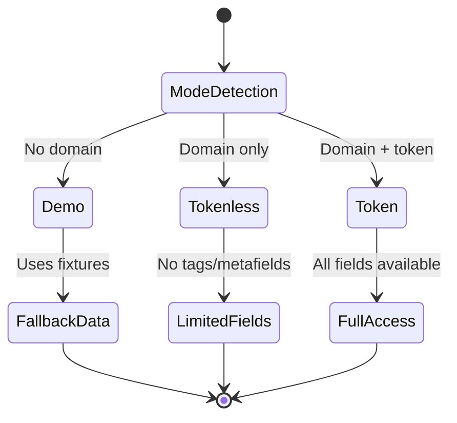
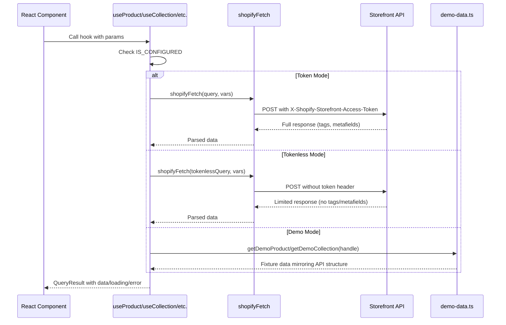

# Shopify Storefront API Integration

## Overview

The application integrates with Shopify Storefront API v2026-01 to provide product browsing, collection navigation, and cart functionality. The integration is designed to work seamlessly across three operational modes, allowing full development without credentials while supporting production-grade e-commerce when configured.

## Operational Modes



| Mode | Condition | Behavior | Fields Available |
|------|-----------|----------|------------------|
| `demo` | No valid credentials | Uses fixture data, no API calls | All (from fixtures) |
| `tokenless` | Domain present, no token | Only tokenless-safe fields | Basic product data, images, prices |
| `token` | Domain + Storefront token | Full API access | Tags, metafields, customer APIs |

### Mode Detection Logic

Mode is determined in [`src/lib/shopify/client.ts`](src/lib/shopify/client.ts:22):

```typescript
function resolveStorefrontMode(): StorefrontMode {
  const hasDomain = !!domain && !PLACEHOLDER_DOMAINS.has(domain)
  const hasToken = !!token
  if (!hasDomain) return 'demo'
  if (!hasToken) return 'tokenless'
  return 'token'
}

export const STOREFRONT_MODE: StorefrontMode = resolveStorefrontMode()
export const IS_CONFIGURED = STOREFRONT_MODE !== 'demo'
```

Placeholder domains (`your-store.myshopify.com`, `CHANGE_ME`) are explicitly checked to prevent accidental tokenless deployments.

## API Configuration

### Environment Variables

| Variable | Required | Mode | Description |
|----------|----------|------|-------------|
| `VITE_SHOPIFY_STORE_DOMAIN` | Token/Tokenless | All | Shopify store domain (e.g., `mornii.myshopify.com`) |
| `VITE_SHOPIFY_STOREFRONT_TOKEN` | Token | Token | Public Storefront API access token |

### API Endpoint

```
POST https://{STORE_DOMAIN}/api/2026-01/graphql.json
```

### Authentication Headers

| Mode | Header | Value |
|------|--------|-------|
| Tokenless | None | Public fields only |
| Token | `X-Shopify-Storefront-Access-Token` | Storefront token value |

## Core Modules

### Client (`@/lib/shopify/client`)

The thin GraphQL client module with no SDK dependency:

```typescript
// Execute a GraphQL query/mutation
const data = await shopifyFetch<CollectionResponse>(COLLECTIONS_QUERY)

// With variables
const product = await shopifyFetch<ProductResponse>(
  PRODUCT_BY_HANDLE_QUERY,
  { handle: 'aria-pendant' }
)
```

**Exports:**
- `STOREFRONT_MODE` - Current operational mode
- `IS_CONFIGURED` - Boolean for live credentials presence
- `shopifyFetch<T>()` - Generic GraphQL executor
- `StorefrontError` - Typed error class with category classification

### Error Categories

The client categorizes errors for appropriate UI handling:

| Category | HTTP Status | Meaning | UI Response |
|----------|-------------|---------|-------------|
| `not_found` | 404 | Resource does not exist | Show 404 page |
| `misconfigured` | 401/403 | Invalid credentials | Show configuration error |
| `upstream_unavailable` | 5xx | Shopify service error | Show retry message |
| `query_error` | N/A | GraphQL-level error | Show query error details |
| `network_error` | N/A | Fetch rejection | Show network error |

### Types (`@/lib/shopify/types`)

TypeScript interfaces matching Shopify Storefront API v2026-01 schema:

```typescript
interface ShopifyMoney {
  amount: string           // Numeric as string for precision
  currencyCode: string     // ISO 4217 (e.g., 'CAD')
}

interface ShopifyImage {
  url: string             // URL with &width={size} support
  altText: string | null
  width: number
  height: number
}

interface ShopifyProductVariant {
  id: string              // GID format: gid://shopify/ProductVariant/...
  title: string
  availableForSale: boolean
  price: ShopifyMoney
  compareAtPrice: ShopifyMoney | null
  selectedOptions: { name: string; value: string }[]
  image: ShopifyImage | null
}

interface ShopifyProduct {
  id: string
  handle: string
  title: string
  description: string
  descriptionHtml: string
  availableForSale: boolean
  featuredImage: ShopifyImage | null
  images: { edges: { node: ShopifyImage }[] }
  options: { id: string; name: string; values: string[] }[]
  variants: { edges: { node: ShopifyProductVariant }[] }
  priceRange: { minVariantPrice: ShopifyMoney; maxVariantPrice: ShopifyMoney }
  tags?: string[]         // Token-gated field
  vendor: string
}

interface ShopifyCollection {
  id: string
  handle: string
  title: string
  description: string
  image: ShopifyImage | null
  products: {
    edges: { node: ShopifyProduct; cursor: string }[]
    pageInfo: { hasNextPage: boolean; endCursor: string | null }
  }
}

interface ShopifyCart {
  id: string
  checkoutUrl: string
  totalQuantity: number
  lines: { edges: { node: ShopifyCartLine }[] }
  cost: {
    subtotalAmount: ShopifyMoney
    totalAmount: ShopifyMoney
    totalTaxAmount: ShopifyMoney | null
  }
}
```

**Utility Functions:**
- [`flattenEdges<T>()`](src/lib/shopify/types.ts:93) - Flattens GraphQL connection edges to array
- [`formatMoney()`](src/lib/shopify/types.ts:98) - Formats money for display using `Intl.NumberFormat`

### Hooks (`@/lib/shopify/hooks`)

TanStack Query hooks wrapping the client with automatic demo fallback:

```typescript
// Collections
const { data: collections } = useCollections()
const { data: collection } = useCollection('everyday', 12, 'PRICE')

// Products
const { data: product } = useProduct('aria-pendant')
const { data: products } = useProducts('BEST_SELLING', false, 'gold', 12)

// Related products (uses product's collections to find similar items)
const { data: related } = useRelatedProducts(handle)
```

**Query Configuration:**
| Hook | Query Key | Default staleTime |
|------|-----------|-------------------|
| `useCollections()` | `['collections']` | 5 minutes |
| `useCollection()` | `['collection', handle, first, sortKey, reverse, after]` | 5 minutes |
| `useProduct()` | `['product', handle]` | 2 minutes |
| `useProducts()` | `['products', sortKey, reverse, query, first, after]` | 5 minutes |
| `useRelatedProducts()` | `['relatedProducts', handle]` | 5 minutes |

**Demo Mode Sorting:**
When in demo mode, the hooks implement client-side sorting that mirrors Shopify behavior:
- `PRICE` - Sorts by `minVariantPrice.amount` numerically
- `TITLE` - Uses `localeCompare()` for alphabetical sorting
- `BEST_SELLING` - Returns fixtures in predefined order

**Demo Mode Pagination:**
Cursor-based pagination is simulated using base64-encoded product IDs:
```typescript
const cursor = btoa(product.id)  // Encode
const id = atob(cursor)          // Decode
```

## GraphQL Queries

### Collections

#### `COLLECTIONS_QUERY`
Fetches first 20 collections with product counts.

**Variables:** None

**Returns:** `collections.edges[].node` with handle, title, description, image, product count

```graphql
query Collections {
  collections(first: 20) {
    edges {
      node {
        id
        handle
        title
        description
        image { ...ImageFields }
        products(first: 1) {
          edges { node { id } }
          pageInfo { hasNextPage }
        }
      }
    }
  }
}
```

#### `COLLECTION_BY_HANDLE_QUERY` (Token Mode)
Fetches single collection with paginated products.

**Variables:** `$handle: String!`, `$first: Int!`, `$after: String`, `$sortKey: ProductCollectionSortKeys`, `$reverse: Boolean`

#### `COLLECTION_BY_HANDLE_QUERY_TOKENLESS` (Tokenless Mode)
Same structure but uses `PRODUCT_CARD_FRAGMENT_TOKENLESS` which omits `tags` field.

### Products

#### `PRODUCTS_QUERY` (Token Mode)
Fetches products with pagination and search.

**Variables:** `$first: Int!`, `$after: String`, `$sortKey: ProductSortKeys`, `$reverse: Boolean`, `$query: String`

#### `PRODUCTS_QUERY_TOKENLESS` (Tokenless Mode)
Same structure without token-gated fields.

#### `PRODUCT_BY_HANDLE_QUERY` (Token Mode)
Fetches single product with full variant data.

**Variables:** `$handle: String!`

**Returns:** Complete product with variants, images, options, price range, tags, and collection membership.

#### `PRODUCT_BY_HANDLE_QUERY_TOKENLESS` (Tokenless Mode)
Same structure without `tags` field.

### Shared Fragments

```graphql
fragment ImageFields on Image {
  url
  altText
  width
  height
}

fragment ProductCardFields on Product {
  id
  handle
  title
  description
  availableForSale
  featuredImage { ...ImageFields }
  priceRange {
    minVariantPrice { amount currencyCode }
    maxVariantPrice { amount currencyCode }
  }
  tags              # Token-gated: omitted in tokenless mode
  vendor
}

fragment VariantFields on ProductVariant {
  id
  title
  availableForSale
  price { amount currencyCode }
  compareAtPrice { amount currencyCode }
  selectedOptions { name value }
  image { ...ImageFields }
}
```

## Cart Mutations

### `CART_CREATE_MUTATION`
Creates a new cart with initial lines.

**Variables:** `$lines: [CartLineInput!]!`

**Returns:** Cart with checkout URL

### `CART_QUERY`
Fetches existing cart by ID.

**Variables:** `$cartId: ID!`

**Returns:** Complete cart object with lines and costs

### `CART_LINES_ADD_MUTATION`
Adds items to an existing cart.

**Variables:** `$cartId: ID!`, `$lines: [CartLineInput!]!`

**Returns:** Updated cart

### `CART_LINES_UPDATE_MUTATION`
Updates quantity of existing cart lines.

**Variables:** `$cartId: ID!`, `$lines: [CartLineUpdateInput!]!`

**Returns:** Updated cart

### `CART_LINES_REMOVE_MUTATION`
Removes items from cart.

**Variables:** `$cartId: ID!`, `$lineIds: [ID!]!`

**Returns:** Updated cart

## Token-Gated Fields

The following fields require a Storefront access token and are excluded from tokenless queries:

| Field | Type | Description |
|-------|------|-------------|
| `Product.tags` | `[String!]` | Product tags for filtering/searching |
| `Product.metafields` | `[Metafield!]` | Custom metadata |
| `Customer` types | Various | Customer account APIs |

The [`token-requirements.ts`](src/lib/shopify/token-requirements.ts) module documents which queries use which fragment variant.

## Demo Data (`@/lib/shopify/demo-data`)

When `IS_CONFIGURED === false`, the app uses fixture data that mirrors Shopify API structure:

**Products (12 total across 3 collections):**
| Collection | Products | Price Range |
|------------|----------|-------------|
| Everyday | Aria Pendant, Seren Studs, Lumiere Bangle, Cassia Chain | $59 - $125 |
| Festive | Noor Chandeliers, Zara Ring, Rania Collar, Farah Drops | $135 - $245 |
| Bridal | Maharani Set, Celestia Tikka, Anaya Jhumkas, Priya Harness | $195 - $450 |

**Image Placeholders:** Generated via `placehold.co` with brand colors (dark background, gold text).

**GID Format:** Demo data uses synthetic GIDs (`gid://shopify/Product/1`, etc.) for compatibility.

## Health Checks

The [`health.ts`](src/lib/shopify/health.ts) module provides API connectivity verification:

```typescript
import { checkShopifyHealth } from '@/lib/shopify/health'

const status = await checkShopifyHealth()
// Returns: { ok: boolean, mode: StorefrontMode, error?: string }
```

## Integration Flow


