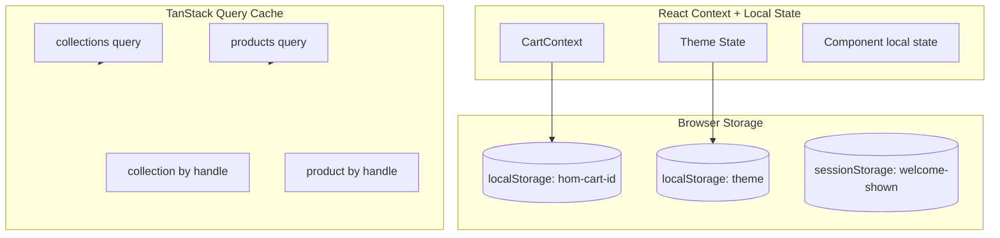
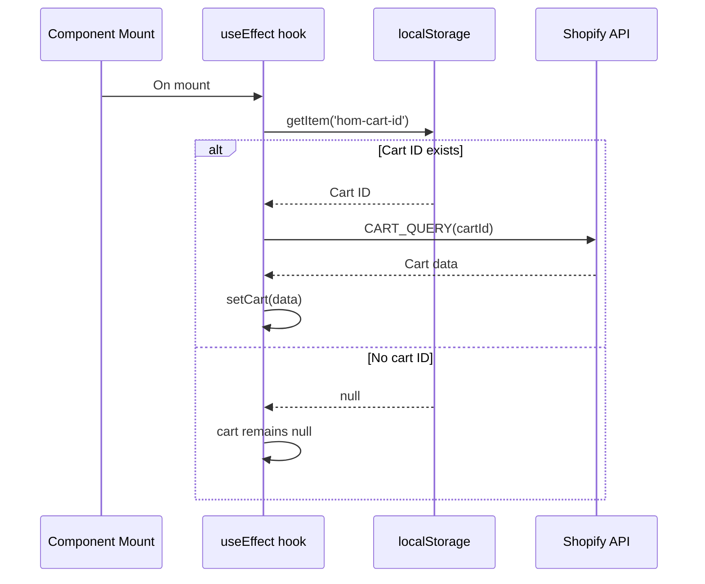
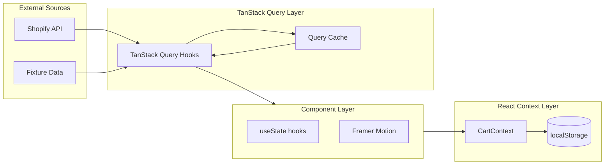

# State Management

## Overview

The application uses a hybrid state management approach:
- **Server state** (products, collections) managed by TanStack Query
- **Client state** (cart, theme, UI) managed by React Context and local state
- **Persistent state** (cart ID, theme preference) managed via localStorage/sessionStorage



## TanStack Query (Server State)

All Shopify data fetching uses TanStack Query (`@tanstack/react-query`) for caching, deduplication, and automatic revalidation.

### Configuration

Query options are defined per-hook in [`src/lib/shopify/hooks.ts`](src/lib/shopify/hooks.ts):

```typescript
// Example: useCollections configuration
useQuery({
  queryKey: ['collections'],
  queryFn: async () => { /* fetch or demo fallback */ },
  staleTime: 5 * 60 * 1000,  // 5 minutes
})
```

### Query Keys and Invalidation

| Hook | Query Key | Invalidation Trigger |
|------|-----------|---------------------|
| `useCollections()` | `['collections']` | Cart mutation (product count changes) |
| `useCollection(handle)` | `['collection', handle, first, sortKey, reverse, after]` | Cart mutation |
| `useProduct(handle)` | `['product', handle]` | Cart mutation |
| `useProducts()` | `['products', sortKey, reverse, query, first, after]` | Cart mutation |

### Demo Mode Fallback Pattern

Every hook checks `IS_CONFIGURED` and returns fixture data when credentials are absent:

```typescript
queryFn: async () => {
  if (!IS_CONFIGURED) {
    return getDemoProduct(handle)
  }
  const data = await shopifyFetch<ProductResponse>(PRODUCT_BY_HANDLE_QUERY, { handle })
  return data.product
}
```

This enables full development and testing without Shopify credentials.

### Query Options Reference

| Option | Default | Purpose |
|--------|---------|---------|
| `staleTime` | 5 minutes (collections/products), 2 minutes (single product) | Time before query is considered stale |
| `enabled` | Varies (false for single-item queries without handle) | Conditional fetching |
| `retry` | TanStack Query default (3) | Error retry count |

## CartContext (Client State)

The shopping cart is managed via React Context in [`src/context/CartContext.tsx`](src/context/CartContext.tsx).

### Context Interface

```typescript
interface CartContextValue {
  cart: ShopifyCart | null
  isLoading: boolean
  itemCount: number
  isCartOpen: boolean
  setCartOpen: (open: boolean) => void
  openCart: () => void
  addToCart: (variantId: string, quantity?: number) => Promise<void>
  updateLineItem: (lineId: string, quantity: number) => Promise<void>
  removeLineItem: (lineId: string) => Promise<void>
  clearCart: () => void
}
```

### Provider Implementation

```tsx
// Usage in App.tsx
import { CartProvider } from '@/context/CartContext'

<CartProvider>
  <App />
</CartProvider>
```

### Cart Persistence Strategy

| Mode | Storage | Key | Behavior |
|------|---------|-----|----------|
| Shopify | localStorage | `hom-cart-id` | Cart ID persisted, restored on mount |
| Demo | In-memory only | N/A | Cart lost on page refresh |

**Restoration Flow:**


### Demo Mode Cart Operations

In demo mode, cart operations use in-memory state with synthetic line IDs:

```typescript
// Demo line ID generation
let _demoLineId = 0
function makeDemoLine(variantId: string, quantity: number): ShopifyCartLine {
  return {
    id: `demo-line-${++_demoLineId}`,
    // ... populated from demo-data.ts fixtures
  }
}
```

### Cart Actions

| Action | Parameters | Behavior |
|--------|------------|----------|
| `addToCart` | `variantId`, `quantity?` | Creates new cart or adds to existing; merges quantities for same variant |
| `updateLineItem` | `lineId`, `quantity` | Updates line quantity via `CART_LINES_UPDATE_MUTATION` |
| `removeLineItem` | `lineId` | Removes line via `CART_LINES_REMOVE_MUTATION` |
| `clearCart` | None | Resets cart to null (demo mode) or clears localStorage |

## Theme State

Theme management is handled by the [`useTheme`](src/hooks/useTheme.ts) hook:

```typescript
const { theme, toggleTheme } = useTheme()
// Returns: { theme: 'dark' | 'light', toggleTheme: () => void }
```

**Persistence:** Theme preference stored in `localStorage` and restored on mount.

**Implementation:** Uses `data-theme` attribute on `<html>` element for CSS targeting.

## UI State (Local Component State)

Most UI state is managed via `useState` within individual components:

| Component | State | Purpose |
|-----------|-------|---------|
| [`Header`](src/components/Header.tsx) | `isOpen` | Mobile menu Sheet open/close |
| [`CartFlyout`](src/components/CartFlyout.tsx) | Controlled by CartContext | Cart drawer visibility |
| [`SearchBar`](src/components/SearchBar.tsx) | `query` | Search input value |
| [`WelcomePopup`](src/components/WelcomePopup.tsx) | Session-based | Popup visibility (once per session) |

### Debounced Navigation

The Header implements debounced navigation to prevent rapid state updates:

```typescript
const navigateDebounced = useCallback(
  (path: string) => {
    if (navigateDebounced.timeoutId) {
      clearTimeout(navigateDebounced.timeoutId)
    }
    navigateDebounced.timeoutId = setTimeout(() => {
      navigate(path)
    }, 200) as unknown as number
  },
  [navigate],
)
```

## Storage Patterns

### localStorage Keys

| Key | Value | Purpose |
|-----|-------|---------|
| `hom-cart-id` | Shopify cart ID (e.g., `gid://shopify/Cart/...`) | Cart persistence across sessions |
| `theme` | `'dark'` or `'light'` | Theme preference |

### sessionStorage Keys

| Key | Value | Purpose |
|-----|-------|---------|
| `welcome-shown` | `'true'` (set after first display) | Welcome popup shown once per session |

### Cart ID Format

Shopify cart IDs follow the GID format:
```
gid://shopify/Cart/1234567890
```

Demo mode uses a fixed ID:
```
demo-cart
```

## Analytics State

Analytics tracking is configured via environment variables and managed in [`src/lib/analytics.ts`](src/lib/analytics.ts):

| Variable | Purpose | Default |
|----------|---------|---------|
| `VITE_GA4_MEASUREMENT_ID` | Google Analytics 4 | Disabled if empty |
| `VITE_META_PIXEL_ID` | Meta Pixel | Disabled if empty |

Page views are tracked automatically in [`AnimatedRoutes`](src/App.tsx:40) on route change:

```typescript
useEffect(() => {
  trackPageView(location.pathname, document.title)
}, [location.pathname])
```

## Error State Handling

Shopify errors are categorized and handled at the page level using the [`useShopifyError`](src/hooks/useShopifyError.ts) hook:

| Category | UI Treatment |
|----------|--------------|
| `not_found` | Render 404 page with navigation options |
| `misconfigured` | Show configuration error banner |
| `upstream_unavailable` | Show retry button with exponential backoff |
| `query_error` | Show error details for debugging |
| `network_error` | Show generic network error message |

## Data Flow Summary


