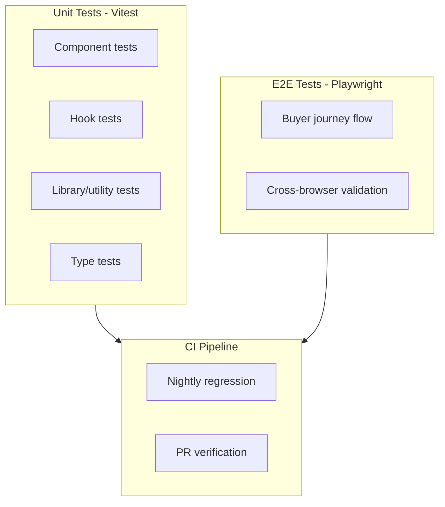
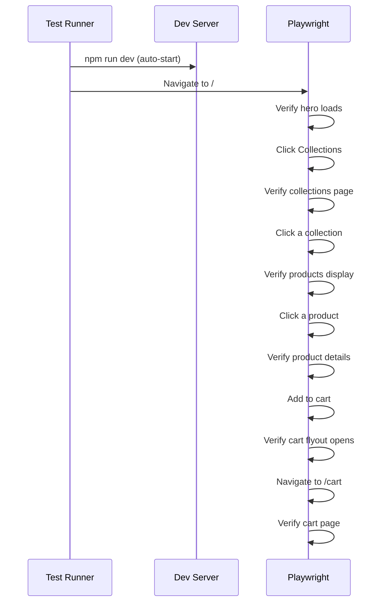
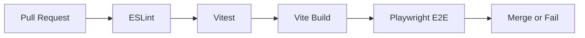

# Testing Strategy

## Overview

The application uses a three-tier testing approach: Vitest for unit/integration tests, Playwright for end-to-end browser tests, and manual verification for visual/design validation.



## Vitest (Unit/Integration Tests)

### Configuration

Tests are configured in [`vitest.config.ts`](vitest.config.ts) with:
- jsdom environment for React component testing
- `@/` path alias resolution via `__dirname`
- Global setup file at `src/test/setup.ts`

### Setup File

The [`src/test/setup.ts`](src/test/setup.ts) file provides essential polyfills and stubs:

```typescript
import '@testing-library/jest-dom/vitest'

// Polyfill IntersectionObserver for framer-motion in jsdom
if (typeof IntersectionObserver === 'undefined') {
  global.IntersectionObserver = class IntersectionObserver { /* ... */ }
}

// Stub Shopify env vars to default to demo mode
if (!import.meta.env.VITE_SHOPIFY_STORE_DOMAIN) {
  import.meta.env.VITE_SHOPIFY_STORE_DOMAIN = ''
}
if (!import.meta.env.VITE_SHOPIFY_STOREFRONT_TOKEN) {
  import.meta.env.VITE_SHOPIFY_STOREFRONT_TOKEN = ''
}

// Mark test environment for siteConfig.ts
import.meta.env.VITEST = 'true'
```

### Test Scripts

| Script | Command | Purpose |
|--------|---------|---------|
| `npm run test` | `vitest` | Watch mode with interactive UI |
| `npm run test:run` | `vitest run` | Single run (CI mode) |

### Running Individual Tests

```bash
npx vitest run src/lib/shopify/client.test.ts
npx vitest run src/components/Header.test.tsx
npx vitest run src/context/CartContext.test.tsx
```

### Test File Locations

Test files live alongside their source files with `.test.ts` or `.test.tsx` suffix:

| Test File | Tests |
|-----------|-------|
| [`src/lib/shopify/client.test.ts`](src/lib/shopify/client.test.ts) | Mode detection, error classification |
| [`src/lib/shopify/demo-data.test.ts`](src/lib/shopify/demo-data.test.ts) | Demo data structure validation |
| [`src/lib/shopify/hooks.test.tsx`](src/lib/shopify/hooks.test.tsx) | Query hook behavior |
| [`src/lib/shopify/types.test.ts`](src/lib/shopify/types.test.ts) | Type helper functions |
| [`src/components/Header.test.tsx`](src/components/Header.test.tsx) | Header rendering, navigation |
| [`src/components/CartFlyout.test.tsx`](src/components/CartFlyout.test.tsx) | Cart drawer interactions |
| [`src/components/AddToCartButton.test.tsx`](src/components/AddToCartButton.test.tsx) | Add to cart flow |
| [`src/components/NewsletterSignup.test.tsx`](src/components/NewsletterSignup.test.tsx) | Newsletter form submission |
| [`src/components/SearchBar.test.tsx`](src/components/SearchBar.test.tsx) | Search input behavior |
| [`src/context/CartContext.test.tsx`](src/context/CartContext.test.tsx) | Cart state management |
| [`src/lib/analytics.test.ts`](src/lib/analytics.test.ts) | Analytics tracking |
| [`src/lib/animations.test.ts`](src/lib/animations.test.ts) | Animation constants |
| [`src/lib/cart.test.ts`](src/lib/cart.test.ts) | Cart utilities |
| [`src/lib/newsletter.test.ts`](src/lib/newsletter.test.ts) | Newsletter handler |
| [`src/pages/CollectionPage.test.tsx`](src/pages/CollectionPage.test.tsx) | Collection page rendering |
| [`src/pages/ShopPage.test.tsx`](src/pages/ShopPage.test.tsx) | Shop page rendering |

### Testing Library Setup

Tests use `@testing-library/react` and `@testing-library/jest-dom`:

```typescript
import { render, screen, fireEvent } from '@/test/utils'
import '@testing-library/jest-dom/vitest'

describe('ProductCard', () => {
  it('renders product title and price', () => {
    render(<ProductCard product={mockProduct} />)
    expect(screen.getByText('Aria Pendant')).toBeInTheDocument()
    expect(screen.getByText('$89.00')).toBeInTheDocument()
  })
})
```

### Test Utilities

The [`src/test/utils.tsx`](src/test/utils.tsx) file provides shared test helpers:

```typescript
// Custom render with providers
export function renderWithProviders(ui, options = {}) {
  return render(ui, {
    wrapper: ({ children }) => (
      <QueryClientProvider client={queryClient}>
        <CartProvider>{children}</CartProvider>
      </QueryClientProvider>
    ),
    ...options,
  })
}
```

### Mocking Strategy

#### Shopify API Mocking

Tests mock the Shopify client to avoid real API calls:

```typescript
import { vi } from 'vitest'
import * as client from '@/lib/shopify/client'

vi.spyOn(client, 'shopifyFetch').mockResolvedValue(mockData)
```

#### Environment Variable Mocking

Tests can override environment variables using `vi.stubEnv()`:

```typescript
vi.stubEnv({
  VITE_SHOPIFY_STORE_DOMAIN: 'test-store.myshopify.com',
  VITE_SHOPIFY_STOREFRONT_TOKEN: 'test-token',
})
```

#### IntersectionObserver Mocking

The global setup file provides an IntersectionObserver polyfill required by Framer Motion in jsdom.

## Playwright (E2E Tests)

### Configuration

Playwright is configured in [`playwright.config.ts`](playwright.config.ts):

```typescript
export default defineConfig({
  testDir: './e2e',
  fullyParallel: false,
  forbidOnly: !!process.env.CI,
  retries: process.env.CI ? 1 : 0,
  workers: 1,
  reporter: process.env.CI ? 'github' : 'html',
  
  use: {
    baseURL: process.env.E2E_BASE_URL ?? 'http://localhost:5173',
    trace: 'on-first-retry',
    screenshot: 'only-on-failure',
    video: 'on-first-retry',
  },
})
```

### Test Scripts

| Script | Command | Purpose |
|--------|---------|---------|
| `npm run test:e2e` | `playwright test` | Run all E2E tests |
| `npm run test:e2e:ui` | `playwright test --ui` | Interactive Playwright UI |
| `npm run test:e2e:report` | `playwright show-report` | Open HTML report |

### Running Against Different Environments

```bash
# Local dev server (auto-started by Playwright)
npm run test:e2e

# Against deployed URL
E2E_BASE_URL=https://houseofmornii.com npm run test:e2e
```

### E2E Test Files

| File | Purpose |
|------|---------|
| [`e2e/buyer-journey.spec.ts`](e2e/buyer-journey.spec.ts) | Full buyer journey flow |

### Buyer Journey Test Flow

The E2E test simulates a complete shopping experience:



### Prerequisites for E2E Tests

E2E tests require a configured Shopify dev store:

```bash
# Required for full integration testing
VITE_SHOPIFY_STORE_DOMAIN=your-dev-store.myshopify.com
VITE_SHOPIFY_STOREFRONT_TOKEN=your_token
```

Without credentials, tests run against demo mode data.

### CI Integration

E2E tests run automatically:
- Every night at 04:00 UTC via `.github/workflows/e2e.yml`
- On PR merge (against deployed preview URL)

## Test Coverage Goals

| Layer | Target | Current Status |
|-------|--------|----------------|
| Unit (Vitest) | >80% | Key modules covered |
| E2E (Playwright) | Critical paths | Buyer journey covered |
| Visual | Manual | Design review process |

## Testing Patterns

### Component Testing Pattern

```typescript
describe('ProductCard', () => {
  const mockProduct: ShopifyProduct = {
    id: 'gid://shopify/Product/1',
    handle: 'aria-pendant',
    title: 'Aria Pendant',
    // ... full mock data
  }

  it('renders product information', () => {
    render(<ProductCard product={mockProduct} />)
    expect(screen.getByText('Aria Pendant')).toBeInTheDocument()
    expect(screen.getByText('$89.00')).toBeInTheDocument()
  })

  it('navigates to product page on click', async () => {
    const user = userEvent.setup()
    render(<ProductCard product={mockProduct} />)
    await user.click(screen.getByRole('link'))
    expect(window.location.pathname).toBe('/products/aria-pendant')
  })
})
```

### Hook Testing Pattern

```typescript
describe('useCollections', () => {
  it('returns demo data when not configured', async () => {
    const { result } = renderHook(() => useCollections())
    await waitFor(() => result.current.isSuccess)
    expect(result.current.data).toHaveLength(3)
  })
})
```

### Context Testing Pattern

```typescript
describe('CartContext', () => {
  it('adds items to cart', async () => {
    render(<TestComponent />) // TestComponent uses useCart()
    const button = screen.getByText('Add to Cart')
    await userEvent.click(button)
    expect(screen.getByText('Added to cart')).toBeInTheDocument()
  })
})
```

## Visual Testing

Visual/design validation is performed manually:

1. **Theme toggle**: Verify dark/light mode transitions
2. **Responsive layout**: Test at various viewport sizes
3. **Animation quality**: Check Framer Motion animations
4. **Golden glow**: Verify under-lighting effect on hover
5. **Glass panels**: Confirm backdrop blur rendering

## Continuous Integration

### CI Pipeline Steps



### Environment Variables in CI

CI pipelines should set:
- `VITE_SHOPIFY_STORE_DOMAIN` - For integration testing
- `VITE_SHOPIFY_STOREFRONT_TOKEN` - For full API coverage
- `CI=true` - Enables CI-specific test behavior
