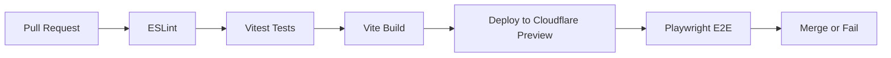

# Deployment Guide

## Overview

The application deploys as a static site to Cloudflare Pages (or any static hosting platform). The build pipeline includes TypeScript compilation, Vite bundling, and production mode guards that prevent accidental demo-mode deployments.

## Prerequisites

- Node.js 20 or later
- npm package manager
- Cloudflare account with Pages access
- GitHub repository admin access (for CI/CD)
- Shopify store with Storefront API access

## Environment Variables

### Required Variables

| Variable | Description | Example |
|----------|-------------|---------|
| `VITE_SHOPIFY_STORE_DOMAIN` | Shopify store domain | `mornii.myshopify.com` |
| `VITE_SHOPIFY_STOREFRONT_TOKEN` | Public Storefront API token | `a1b2c3d4...` |

### Optional Variables

| Variable | Description | Default |
|----------|-------------|---------|
| `VITE_SITE_NAME` | Site name for SEO | `House of Mornii` |
| `VITE_SITE_TITLE` | Page title suffix | `House of Mornii Preview` |
| `VITE_SITE_DESCRIPTION` | Meta description | Development placeholder |
| `VITE_SITE_URL` | Canonical URL base | `http://localhost:5173` |
| `VITE_SITE_OG_IMAGE_PATH` | Open Graph image path | `/og-image.png` |
| `VITE_SITE_OG_IMAGE_ALT` | OG image alt text | `House of Mornii preview image` |
| `VITE_THEME_COLOR` | Theme color for browser UI | `oklch(0.15 0.02 210)` |
| `VITE_CONTACT_EMAIL` | Contact email address | (empty) |
| `VITE_INSTAGRAM_HANDLE` | Instagram username | `@houseofmornii` |
| `VITE_INSTAGRAM_URL` | Instagram profile URL | `https://instagram.com/houseofmornii` |
| `VITE_CONTACT_LOCATION_LABEL` | Location description | `Appointment details coming soon` |
| `VITE_NEWSLETTER_ENDPOINT` | Newsletter API endpoint | (empty - prototype mode) |
| `VITE_NEWSLETTER_EYEBROW` | Newsletter form eyebrow text | `Join the House of Mornii list` |
| `VITE_NEWSLETTER_PLACEHOLDER` | Input placeholder | `your@email.com` |
| `VITE_NEWSLETTER_CTA` | Submit button text | `Join` |
| `VITE_NEWSLETTER_LOADING_LABEL` | Loading state text | `Joining...` |
| `VITE_NEWSLETTER_SUCCESS_MESSAGE` | Success feedback | `Thank you. We will share updates...` |
| `VITE_NEWSLETTER_ERROR_MESSAGE` | Error feedback | `We could not save your email...` |
| `VITE_WELCOME_POPUP_EYEBROW` | Welcome popup eyebrow | `Welcome` |
| `VITE_WELCOME_POPUP_TITLE` | Welcome popup title | `House of Mornii Preview` |
| `VITE_WELCOME_POPUP_DESCRIPTION` | Welcome popup description | `Join the list for collection previews...` |

### Analytics (Optional)

| Variable | Description | Example |
|----------|-------------|---------|
| `VITE_GA4_MEASUREMENT_ID` | Google Analytics 4 ID | `G-XXXXXXXXXX` |
| `VITE_META_PIXEL_ID` | Meta Pixel ID | `1234567890` |

**Note:** Omit analytics variables entirely to disable tracking. Do not set them to empty strings (omit is preferred).

## Local Development Setup

### Initial Setup

```bash
git clone git@github.com:YOUR_ORG/house-of-mornii-shop.git
cd house-of-mornii-shop
npm install
```

### Environment Configuration

```bash
# Copy example env file
cp .env.example .env.local

# Edit with your credentials
# VITE_SHOPIFY_STORE_DOMAIN=your-store.myshopify.com
# VITE_SHOPIFY_STOREFRONT_TOKEN=your-token
```

### Start Development Server

```bash
npm run dev
# → http://localhost:5173
```

### Demo Mode (No Credentials)

If Shopify credentials are left empty, the app runs in **demo mode** with fixture data. This is the default for new contributors and enables full development without Shopify access.

## Build Process

### Local Build

```bash
# TypeScript compile + Vite production build
npm run build

# Preview production build locally
npm run preview
# → http://localhost:4173
```

### Production Build Guards

The build process includes safety checks in [`vite.config.ts`](vite.config.ts:9):

```typescript
if (process.env.NODE_ENV === 'production') {
  const domain = process.env.VITE_SHOPIFY_STORE_DOMAIN
  const token = process.env.VITE_SHOPIFY_STOREFRONT_TOKEN

  // Guard 1: Credentials must be present
  if (!domain || !token) {
    console.error('[BUILD ERROR] Production build requires Shopify credentials.')
    process.exit(1)
  }

  // Guard 2: Placeholder domains blocked
  const PLACEHOLDER_DOMAINS = ['your-store.myshopify.com', 'CHANGE_ME']
  if (PLACEHOLDER_DOMAINS.some(d => domain.includes(d))) {
    console.error('[BUILD ERROR] Production build blocked: Placeholder domain detected.')
    process.exit(1)
  }
}
```

These guards prevent accidental deployment of the demo-mode application to production.

## Cloudflare Pages Deployment

### GitHub Integration Setup

1. Navigate to Cloudflare Dashboard → Pages → Create a project → Connect to Git
2. Select the repository
3. Configure build settings:

| Setting | Value |
|---------|-------|
| Project name | `house-of-mornii-shop` |
| Production branch | `main` |
| Build command | `npm run build` |
| Build output directory | `dist` |
| Root directory | `/` (or root) |

### Environment Variables Configuration

Add required environment variables in Cloudflare Pages settings:

1. Go to Project Settings → Environment Variables
2. Add each `VITE_*` variable from the table above
3. Set appropriate values for production

### Custom Domain Setup

1. Go to Custom Domains in Cloudflare Pages
2. Add your domain (e.g., `houseofmornii.com`)
3. Update DNS records as instructed
4. SSL/TLS mode should be set to Full or Full (strict)

### _redirects and _headers Files

The project includes configuration files in `public/` for proper routing and security:

**[`public/_redirects`](public/_redirects):**
```
# SPA fallback - all routes to index.html
/*    /index.html 200
```

**[`public/_headers`](public/_headers):**
```
# Security headers
/
  X-Content-Type-Options: nosniff
  X-Frame-Options: DENY
  Referrer-Policy: strict-origin-when-cross-origin
```

## CI/CD Pipeline

### GitHub Actions Workflow

The project uses `.github/workflows/e2e.yml` for automated testing:

**Nightly E2E Tests:**
- Runs every day at 04:00 UTC
- Executes against production deployment URL
- Reports results via GitHub Actions

**PR Verification:**
- Lint check on push
- Vitest unit tests on push
- Build verification on push to main

### CI Pipeline Flow



## Deployment Checklist

### Pre-Deployment

- [ ] All environment variables configured in Cloudflare Pages
- [ ] Shopify credentials verified (domain + token)
- [ ] `VITE_SITE_URL` updated to production domain
- [ ] `VITE_SITE_DESCRIPTION` updated for production SEO
- [ ] Analytics IDs configured (if applicable)
- [ ] Newsletter endpoint configured (if applicable)
- [ ] Contact information finalized
- [ ] OG image (`public/og-image.png`) uploaded
- [ ] Sitemap (`public/sitemap.xml`) updated with production URLs
- [ ] Robots.txt (`public/robots.txt`) configured

### Post-Deployment Verification

- [ ] Site loads on production URL
- [ ] All pages render correctly
- [ ] Shopify data loads (collections, products)
- [ ] Cart functionality works
- [ ] Theme toggle works (dark/light mode)
- [ ] Mobile responsive layout verified
- [ ] SEO meta tags correct (check page source)
- [ ] Analytics tracking active (if configured)
- [ ] E2E tests pass against production URL

## Rollback Procedure

If a deployment has issues:

1. Go to Cloudflare Pages → Deployments
2. Find the last successful deployment
3. Click "Promote to production"
4. Verify site is working correctly

## Troubleshooting

### Build Fails with Demo Mode Error

```
[BUILD ERROR] Production build requires Shopify credentials.
```

**Solution:** Ensure `VITE_SHOPIFY_STORE_DOMAIN` and `VITE_SHOPIFY_STOREFRONT_TOKEN` are set in Cloudflare Pages environment variables.

### Build Fails with Placeholder Domain Error

```
[BUILD ERROR] Production build blocked: Placeholder domain detected.
```

**Solution:** Update `VITE_SHOPIFY_STORE_DOMAIN` to your actual Shopify store domain.

### Site Shows Demo Data in Production

**Cause:** Environment variables not properly set or cached.

**Solution:**
1. Verify environment variables in Cloudflare Pages settings
2. Trigger a new deployment (push empty commit or rebuild)
3. Clear Cloudflare cache if needed

### SSL/Certificate Issues

**Solution:**
1. Ensure DNS is properly configured in Cloudflare
2. Check SSL/TLS mode is set to Full or Full (strict)
3. Wait for certificate propagation (usually instant)

## Performance Optimization

### Vite Build Output

The production build produces:
- Minified JavaScript bundles with code splitting
- CSS extracted and optimized
- Static assets hashed and cached
- Source maps generated for debugging

### Cloudflare Performance Features

Enable these in Cloudflare Pages settings:
- **Auto Minify:** JavaScript, CSS, HTML
- **Brotli Compression:** Enabled by default
- **Cache Level:** Standard (respect Cache-Control headers)
- **Rocket Loader:** Consider enabling for JS optimization

### Caching Strategy

Shopify images use query parameters (`&width=...`) which Cloudflare caches separately by default. Configure cache rules if needed:

```
Cache Rule: /assets/* → Cache Level: Cache Everything, Edge TTL: 1 year
Cache Rule: /* → Cache Level: Basic (respect origin headers)
```
