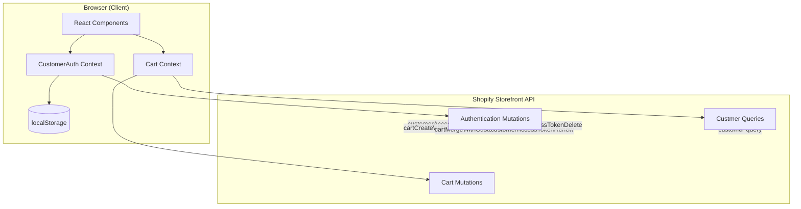

# Customer Account Integration Plan

## Overview

This plan adds full Shopify Customer Account API integration to the House of Mornii Shop storefront. The current cart uses only anonymous Storefront API mutations with localStorage-based persistence. This plan introduces: (1) customer authentication via `authenticationUrl` redirect, (2) guest-to-account cart merge on login, (3) customer profile and order history queries, and (4) customer access token lifecycle management with `recoveryToken`-based renewal.

## Objectives

1. Enable customers to create accounts and log in via Shopify's recommended `authenticationUrl` flow
2. Merge anonymous guest carts into customer account carts upon authentication
3. Display customer profile data (name, email, addresses) and order history
4. Manage customer access tokens with automatic renewal via `recoveryToken`
5. Maintain backward compatibility — anonymous cart operations continue to work for unauthenticated users

## Architecture Overview



## Steps

### Step 1: Add Customer Types to `src/lib/shopify/types.ts`

Create TypeScript interfaces matching Shopify's Storefront API customer schema.

**File:** `src/lib/shopify/types.ts` (append)

New types:

```typescript
export interface ShopifyCustomer {
  id: string
  firstName: string | null
  lastName: string | null
  email: string
  phone: string | null
  acceptsMarketing: boolean
  addresses: { edges: { node: ShopifyMailingAddress }[] }
  orders: {
    edges: { node: ShopifyOrder }[]
    pageInfo: { hasNextPage: boolean; endCursor: string | null }
  }
}

export interface ShopifyMailingAddress {
  id: string
  firstName: string
  lastName: string
  address1: string
  city: string
  province: string
  country: string
  zip: string
  phone: string
}

export interface ShopifyOrder {
  id: string
  name: string
  orderNumber: number
  processedAt: string
  totalPrice: ShopifyMoney
  financialStatus: string
  fulfillmentStatus: string | null
  lineItems: { edges: { node: ShopifyOrderLineItem }[] }
}

export interface ShopifyOrderLineItem {
  title: string
  quantity: number
  originalPrice: ShopifyMoney
  image: ShopifyImage | null
}

export interface ShopifyCustomerAccessToken {
  accessToken: string
  expiresAt: string
  recoveryToken?: string
}

export interface ShopifyAuthenticationURL {
  url: string | null
}

export interface ShopifyCustomerUserError {
  field: string | null
  message: string
  code: string | null
}
```

### Step 2: Add Customer GraphQL Queries/Mutations to `src/lib/shopify/queries.ts`

Add the following new exports to [`src/lib/shopify/queries.ts`](src/lib/shopify/queries.ts):

**New mutations:**

| Export Name | Purpose | Variables |
|-------------|---------|-----------|
| `CUSTOMER_ACCESS_TOKEN_CREATE_MUTATION` | Login with email/password | `$input: CustomerAccessTokenCreateInput!` |
| `CUSTOMER_ACCESS_TOKEN_DELETE_MUTATION` | Logout | `$input: CustomerAccessTokenDeleteInput!` |
| `CUSTOMER_ACCESS_TOKEN_RENEW_MUTATION` | Renew expired token | `$input: CustomerAccessTokenRenewInput!` |
| `CUSTOMER_CREATE_MUTATION` | Register new account | `$input: CustomerCreateInput!` |
| `CUSTOMER_RECOVER_MUTATION` | Password recovery request | `$input: CustomerRecoverInput!` |
| `CUSTOMER_RESET_MUTATION` | Reset password | `$input: CustomerResetInput!` |
| `CUSTOMER_UPDATE_MUTATION` | Update profile | `$input: CustomerUpdateInput!` |

**New cart mutations:**

| Export Name | Purpose | Variables |
|-------------|---------|-----------|
| `CART_CREATE_WITH_AUTH_URL_MUTATION` | Create cart + auth redirect URL | `$lines: [CartLineInput!]!` |
| `CART_MERGE_WITH_CUSTOMER_ACCESS_TOKEN_MUTATION` | Merge guest cart into account cart | `$cartId: ID!, $customerAccessToken: String!` |

**New queries:**

| Export Name | Purpose | Variables |
|-------------|---------|-----------|
| `CUSTOMER_QUERY` | Fetch logged-in customer data | N/A |
| `CUSTOMER_BY_ACCESS_TOKEN_QUERY` | Fetch customer via token | `$customerAccessToken: String!` |

### Step 3: Create Customer Auth Context — `src/context/CustomerAuthContext.tsx`

New file: [`src/context/CustomerAuthContext.tsx`](src/context/CustomerAuthContext.tsx)

This context manages the entire customer authentication lifecycle.

**Interface:**

```typescript
interface CustomerAuthContextValue {
  customer: ShopifyCustomer | null
  accessToken: string | null
  isAuthenticated: boolean
  isLoading: boolean
  login: (email: string, password: string) => Promise<void>
  register: (input: CustomerCreateInput) => Promise<void>
  logout: () => Promise<void>
  initiatePasswordRecovery: (email: string) => Promise<void>
  resetPassword: (password: string, token: string, id: string) => Promise<void>
  updateProfile: (input: CustomerUpdateInput) => Promise<void>
  getAuthenticationUrl: () => Promise<string | null>
  refreshAccessToken: () => Promise<void>
}
```

**Key behaviors:**

- On mount: check localStorage for `hom-customer-access-token` and `hom-customer-recovery-token`. If a valid token exists, query the customer to validate it. If the token is expired but has a recoveryToken, call `customerAccessTokenRenew` automatically.
- `login()`: calls `CUSTOMER_ACCESS_TOKEN_CREATE_MUTATION`, stores accessToken + recoveryToken in localStorage, fetches customer data.
- `logout()`: calls `CUSTOMER_ACCESS_TOKEN_DELETE_MUTATION`, clears all customer-related localStorage keys.
- `getAuthenticationUrl()`: for OAuth-style login, returns the authentication URL from `cartCreateWithAuthenticationUrl` or a dedicated auth endpoint.
- `refreshAccessToken()`: calls `customerAccessTokenRenew` using the stored recoveryToken.

**localStorage keys:**

| Key | Value | Purpose |
|-----|-------|---------|
| `hom-customer-access-token` | JWT-like access token | Customer session |
| `hom-customer-recovery-token` | Renewal token | Token refresh |
| `hom-customer-expires-at` | ISO timestamp | Token expiry check |

### Step 4: Integrate Customer Auth into CartContext — `src/context/CartContext.tsx`

Modify [`src/context/CartContext.tsx`](src/context/CartContext.tsx) to:

1. Import `useCustomerAuth` from the new context
2. On mount, check if customer is authenticated. If so, query for any existing cart associated with the customer's access token using `CART_QUERY` with buyer identity.
3. In `addToCart()`: when authenticated, pass `customerAccessToken` in the cart mutation input's `buyerIdentity` field to associate the cart line with the customer account.
4. After successful `login()` in CustomerAuthContext: trigger a cart merge by calling `CART_MERGE_WITH_CUSTOMER_ACCESS_TOKEN_MUTATION` if there was an active anonymous cart.
5. After `logout()`: do NOT clear the cart — keep it as anonymous so the user can continue browsing. Clear only customer-related state.

**Cart merge flow:**

```mermaid
sequenceDiagram
    participant UI as Login UI
    participant Auth as CustomerAuthContext
    participant Cart as CartContext
    participant API as Shopify API

    UI->>Auth: login(email, password)
    Auth->>API: customerAccessTokenCreate
    API-->>Auth: accessToken + recoveryToken
    Auth->>Auth: store tokens in localStorage
    Auth->>Cart: emit 'authenticated' event

    Cart->>API: cartMergeWithCustomerAccessToken(
        cartId: <anonymous-cart-id>,
        customerAccessToken: <token>)
    API-->>Cart: merged cart
    Cart->>Cart: update local cart state
    Cart->>API: cartLinesRemove (clean up stale lines)
```

### Step 5: Wrap App with CustomerAuthContext — `src/App.tsx`

Modify [`src/App.tsx`](src/App.tsx) to add the `CustomerAuthProvider` alongside the existing `CartProvider`.

**File changes in `src/App.tsx`:**

- Import `CustomerAuthProvider` from `@/context/CustomerAuthContext`
- Wrap the app tree: `<CartProvider><CustomerAuthProvider>...</CustomerAuthProvider></CartProvider>`

### Step 6: Add Customer Login/Register UI Components

Create new UI components for authentication flows.

**New files:**

| File | Purpose |
|------|---------|
| `src/components/LoginModal.tsx` | Modal with email/password login form |
| `src/components/RegisterModal.tsx` | Modal with account registration form |
| `src/components/PasswordRecoveryModal.tsx` | Password reset request form |
| `src/components/CustomerMenu.tsx` | Dropdown showing customer name + links to profile/orders |

**Integration points:**

- Replace or augment the existing [`Header`](src/components/Header.tsx) with a customer avatar/icon when authenticated that opens the `CustomerMenu` dropdown.
- Login/Register links in the header open `LoginModal` / `RegisterModal`.

### Step 7: Create Customer Profile and Order History Pages

New pages for authenticated user features.

**New files:**

| File | Route | Purpose |
|------|-------|---------|
| `src/pages/AccountPage.tsx` | `/account` | Customer profile overview with navigation to sub-sections |
| `src/pages/OrdersPage.tsx` | `/account/orders` | Paginated order history list |
| `src/pages/OrderDetailPage.tsx` | `/account/orders/:orderNumber` | Single order details |
| `src/pages/AddressesPage.tsx` | `/account/addresses` | Manage shipping addresses |

### Step 8: Update Header to Show Auth State

Modify [`src/components/Header.tsx`](src/components/Header.tsx):

- Add a customer icon/button that shows login state
- When authenticated: display customer name initial + dropdown menu with "My Account", "Orders", "Addresses", "Logout"
- When unauthenticated: show "Login" / "Register" links

### Step 9: Update Documentation

Update the following documentation files to reflect the new customer account integration:

| File | Changes |
|------|---------|
| `docs/04-state-management.md` | Add CustomerAuthContext section, new localStorage keys, auth state diagram |
| `docs/03-shopify-integration.md` | Add customer API section, authentication flow diagram, cart merge explanation |
| `docs/SHOPIFY_STOREFRONT_API.md` | Add all new mutations and queries to the reference table |

## File Changes Summary

### New Files (8)

| File | Lines (est.) | Purpose |
|------|-------------|---------|
| `src/context/CustomerAuthContext.tsx` | ~300 | Customer authentication state management |
| `src/components/LoginModal.tsx` | ~120 | Login form modal |
| `src/components/RegisterModal.tsx` | ~150 | Registration form modal |
| `src/components/PasswordRecoveryModal.tsx` | ~100 | Password recovery form |
| `src/components/CustomerMenu.tsx` | ~80 | Authenticated user dropdown menu |
| `src/pages/AccountPage.tsx` | ~60 | Account overview page |
| `src/pages/OrdersPage.tsx` | ~120 | Order history page |
| `src/pages/OrderDetailPage.tsx` | ~100 | Single order detail page |

### Modified Files (5)

| File | Changes |
|------|---------|
| `src/lib/shopify/types.ts` | Append customer-related TypeScript interfaces (~80 lines) |
| `src/lib/shopify/queries.ts` | Add 10+ new GraphQL mutations and queries (~200 lines) |
| `src/context/CartContext.tsx` | Integrate auth context, add cart merge logic (~50 line changes) |
| `src/App.tsx` | Wrap with CustomerAuthProvider (~3 line changes) |
| `src/components/Header.tsx` | Add customer icon/button + menu integration (~30 line changes) |

### Documentation Updates (3)

| File | Changes |
|------|---------|
| `docs/04-state-management.md` | Add CustomerAuthContext section and diagrams |
| `docs/03-shopify-integration.md` | Add customer API documentation |
| `docs/SHOPIFY_STOREFRONT_API.md` | Add new mutations/queries reference |

## Risks and Mitigation

| Risk | Severity | Mitigation |
|------|----------|------------|
| Token expiry during active shopping session | Medium | Implement silent `recoveryToken` renewal in a `useEffect` that checks token expiry on route changes |
| Cart merge conflicts (same item added by both guest and account) | Low | Shopify's cart merge handles deduplication automatically via merchandise ID matching |
| Customer data exposure in localStorage | Medium | Store only tokens, not PII. Tokens are short-lived. Add comments warning against logging token values |
| Demo mode compatibility | Medium | All customer operations must check `IS_CONFIGURED` and gracefully degrade — show "Sign in unavailable in demo mode" toast |
| Existing anonymous carts lost on page refresh after merge | Low | After cart merge, store the merged (now account-bound) cart ID in localStorage as before |
| Password handling security | High | Never log or display passwords. All password mutations use HTTPS-only GraphQL calls. Add security comments to code |

## Implementation Order

1. **Types** — Add customer interfaces to `types.ts` (no runtime impact)
2. **Queries/Mutations** — Add GraphQL strings to `queries.ts` (no runtime impact)
3. **CustomerAuthContext** — Core auth logic (most complex piece)
4. **Cart merge integration** — Modify `CartContext.tsx`
5. **App wrapper** — Add `CustomerAuthProvider` to `App.tsx`
6. **UI components** — Login/Register modals, customer menu
7. **Header update** — Show auth state in navigation
8. **Account pages** — Profile, orders, addresses
9. **Documentation** — Update all docs

## Testing Considerations

- Unit tests for `CustomerAuthContext`: mock GraphQL responses for login, logout, token renewal
- Integration test: verify cart merge flow after login (anonymous cart items appear in account cart)
- E2E test: register -> add to cart as guest -> login -> verify cart preserved -> view orders
- Demo mode test: verify all customer features show appropriate "unavailable" messages when `IS_CONFIGURED` is false
