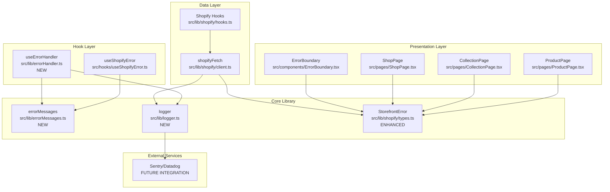
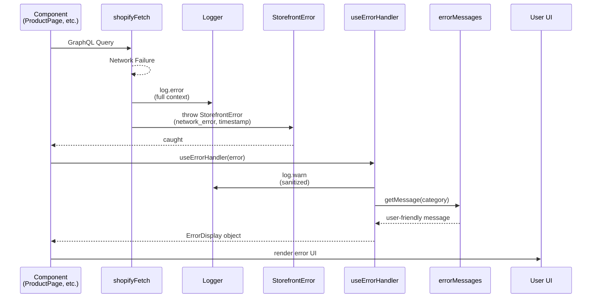
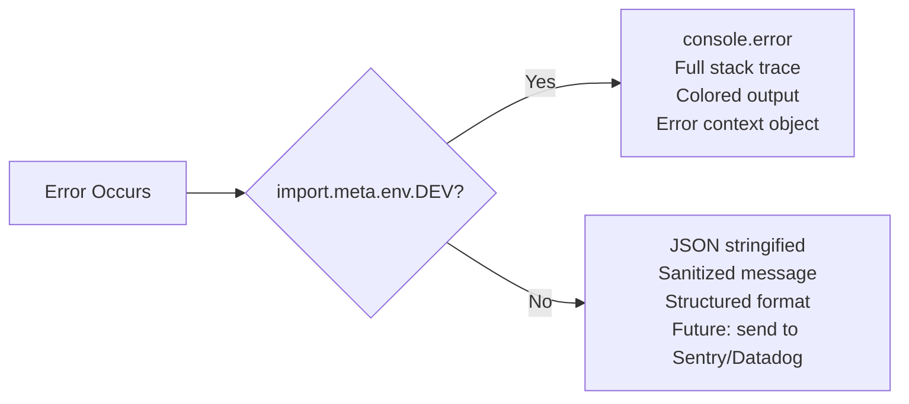

# Centralized Error Handling Architecture

## 1. Module Structure



## 2. Data Flow for Errors

### 2a. Error Origin to User Feedback



### 2b. Dev vs Prod Logger Behavior



## 3. API Surface for New Modules

### 3.1 Centralized Logger (`src/lib/logger.ts`)

```typescript
// Severity levels for structured logging
export type LogLevel = 'error' | 'warn' | 'info'

// Context object attached to all log entries
export interface LogContext {
  component?: string      // React component name
  page?: string           // Current route/page
  productId?: string      // Product ID context
  collectionId?: string   // Collection ID context
  variantId?: string      // Variant ID context
  action?: string         // User action that triggered error
  [key: string]: unknown  // Extensible for future fields
}

// Base log entry structure (used in both dev and prod)
export interface LogEntry {
  timestamp: string       // ISO 8601 format
  level: LogLevel
  message: string         // Sanitized for prod, detailed for dev
  context?: LogContext
  stack?: string          // Only in dev mode
  metadata?: Record<string, unknown>
}

// Logger interface
export interface ILogger {
  error(message: string, context?: LogContext, metadata?: Record<string, unknown>): void
  warn(message: string, context?: LogContext, metadata?: Record<string, unknown>): void
  info(message: string, context?: LogContext, metadata?: Record<string, unknown>): void
  
  // Child logger with pre-populated context
  child(context: LogContext): ILogger
}

// Factory function
export function createLogger(options?: { namespace?: string }): ILogger
```

**Dev Mode Output Example:**
```
[ERROR] [2025-01-15T10:30:45.123Z] [ProductPage] Failed to fetch product
  ┌─────────────────────────────────────────────────────┐
  │ component: "ProductPage"                            │
  │ page: "/products/amber-drop-ring"                   │
  │ productId: "gid://shopify/Product/12345"            │
  │ action: "useProduct query"                          │
  ├─────────────────────────────────────────────────────┤
  │ Stack trace:                                        │
  │   at shopifyFetch (src/lib/shopify/client.ts:98)    │
  │   at useProduct (src/lib/shopify/hooks.ts:45)       │
  │   ...                                               │
  └─────────────────────────────────────────────────────┘
```

**Prod Mode Output Example:**
```json
{"timestamp":"2025-01-15T10:30:45.123Z","level":"error","message":"Failed to fetch product","context":{"component":"ProductPage","page":"/products/amber-drop-ring"},"metadata":{"category":"network_error"}}
```

### 3.2 Error Message Registry (`src/lib/errorMessages.ts`)

```typescript
// Error categories (extended from StorefrontError)
export type ErrorCategory =
  | 'not_found'           // Resource does not exist
  | 'misconfigured'       // Invalid credentials/config
  | 'upstream_unavailable' // Shopify service error
  | 'query_error'         // GraphQL-level error
  | 'network_error'       // Unhandled network failure (NEW)

// User-facing error message structure
export interface ErrorMessage {
  title: string           // Short heading for UI
  message: string         // Detailed explanation
  showRetry: boolean      // Whether to show retry button
  showHomeLink: boolean   // Whether to show home link
}

// Map category + context to user-friendly message
export function getErrorMessage(
  category: ErrorCategory,
  context?: LogContext
): ErrorMessage

// Individual category getters (for granular control)
export function getNotFoundMessage(context?: LogContext): ErrorMessage
export function getMisconfiguredMessage(): ErrorMessage
export function getUnavailableMessage(): ErrorMessage
export function getQueryErrorMessage(): ErrorMessage
export function getNetworkErrorMessage(): ErrorMessage

// Generic fallback for unhandled errors
export function getGenericErrorMessage(showRetry?: boolean): ErrorMessage
```

**Message Registry Table:**

| Category | Title | Message | Retry | Home |
|----------|-------|---------|-------|------|
| `not_found` | Content Not Found | The content you're looking for does not exist or has been removed. | No | Yes |
| `misconfigured` | Configuration Error | The storefront is not properly configured. Please try again later. | No | Yes |
| `upstream_unavailable` | Service Unavailable | We're experiencing technical difficulties. Please try again shortly. | Yes | No |
| `query_error` | Data Error | An error occurred while loading data. Please refresh the page. | Yes | No |
| `network_error` | Connection Error | Unable to connect to our servers. Please check your internet connection. | Yes | No |

### 3.3 Enhanced StorefrontError (`src/lib/shopify/types.ts`)

```typescript
// Extended error categories
export type StorefrontErrorCategory =
  | 'not_found'
  | 'misconfigured'
  | 'upstream_unavailable'
  | 'query_error'
  | 'network_error'  // NEW: for unhandled network failures

export class StorefrontError extends Error {
  readonly category: StorefrontErrorCategory
  readonly statusCode?: number
  readonly timestamp: Date      // NEW: when error occurred
  readonly context?: LogContext // NEW: contextual information

  constructor(
    message: string,
    category: StorefrontErrorCategory,
    statusCode?: number,
    context?: LogContext
  )
}
```

### 3.4 Error Handler Hook (`src/lib/errorHandler.ts`) - NEW

```typescript
// Replaces useShopifyError.ts with centralized messages
export function useErrorHandler(error?: Error): ErrorDisplay | null

// Unified error display interface
export interface ErrorDisplay {
  title: string
  message: string
  showRetry: boolean
  showHomeLink: boolean
}

// Helper to check if error is a service-level failure
export function isServiceError(error?: Error): boolean

// Helper to get error category from any Error
export function getErrorCategory(error: Error): ErrorCategory | 'unknown'
```

## 4. Migration Plan

### Phase 1: Create Core Infrastructure

**Files to create:**
1. `src/lib/logger.ts` - Centralized logger with dev/prod differentiation
2. `src/lib/errorMessages.ts` - Error message registry
3. `src/lib/errorHandler.ts` - Unified error handler hook

**Changes to existing files:**
1. Extend `StorefrontError` in `src/lib/shopify/types.ts`:
   - Add `network_error` category
   - Add `timestamp` and `context` fields

### Phase 2: Update Shopify Client Layer

**File: `src/lib/shopify/client.ts`**

```typescript
// BEFORE (current):
export async function shopifyFetch<T = unknown>(
  query: string,
  variables: Record<string, unknown> = {}
): Promise<T> {
  // ... fetch logic
  if (!response.ok) {
    // throws StorefrontError but no network error handling
  }
  // ...
}

// AFTER (proposed):
import { logger } from '@/lib/logger'

export async function shopifyFetch<T = unknown>(
  query: string,
  variables: Record<string, unknown> = {},
  context?: LogContext
): Promise<T> {
  try {
    // ... existing fetch logic
    if (!response.ok) {
      // ... existing status code handling
    }
    // ... existing error handling
    
    return json.data
  } catch (error) {
    // NEW: Catch network errors and throw StorefrontError
    if (error instanceof TypeError) {
      const networkError = new StorefrontError(
        'Network request failed',
        'network_error',
        undefined,
        context
      )
      logger.error('Shopify API network error', {
        ...context,
        action: 'shopifyFetch',
        queryPreview: query.substring(0, 100)
      })
      throw networkError
    }
    
    // Re-throw known StorefrontErrors (they already have logging)
    if (error instanceof StorefrontError) {
      logger.error(error.message, {
        ...context,
        category: error.category,
        statusCode: error.statusCode
      })
      throw error
    }
    
    // Wrap unknown errors
    logger.error('Unexpected Shopify API error', {
      ...context,
      action: 'shopifyFetch',
      errorName: error instanceof Error ? error.name : 'unknown'
    })
    throw new StorefrontError(
      'An unexpected error occurred while fetching data',
      'network_error',
      undefined,
      context
    )
  }
}
```

### Phase 3: Replace Duplicate Error Messages

**Files to update:**
1. `src/hooks/useShopifyError.ts` - DEPRECATED (replace with `useErrorHandler`)
2. `src/components/ErrorBoundary.tsx` - Use centralized logger + messages
3. `src/pages/ProductPage.tsx` - Use `getErrorMessage` instead of inline strings
4. `src/pages/CollectionPage.tsx` - Use `getErrorMessage` instead of inline strings

**ErrorBoundary migration:**
```typescript
// BEFORE:
public componentDidCatch(error: Error, errorInfo: ErrorInfo) {
  console.error('ErrorBoundary caught:', error, errorInfo)
}

private getCategoryTitle(category?: StorefrontErrorCategory): string {
  switch (category) {
    case 'not_found': return 'Content Not Found'
    // ... duplicate messages
  }
}

// AFTER:
public componentDidCatch(error: Error, errorInfo: ErrorInfo) {
  logger.error('ErrorBoundary caught error', {
    component: 'ErrorBoundary',
    action: 'componentDidCatch',
    errorName: error.name,
    stack: import.meta.env.DEV ? error.stack : undefined
  })
}

// In render():
const errorDisplay = getErrorMessage(error?.category ?? 'unknown')
// Use errorDisplay.title and errorDisplay.message directly
```

### Phase 4: Cleanup

**Files to delete:**
1. `src/lib/shopify/logger.ts` - Unused structured logging (replaced by `src/lib/logger.ts`)

**Files to refactor:**
1. `src/hooks/useShopifyError.ts` - Either deprecate or rewrite to use `errorMessages.ts`

## 5. Test Strategy

### 5.1 Unit Tests

#### Logger Tests (`src/lib/logger.test.ts`)

```typescript
describe('Logger', () => {
  describe('Dev mode', () => {
    it('outputs full stack traces via console.error', () => {})
    it('includes context object in output', () => {})
    it('includes ISO timestamp', () => {})
    it('supports colored output for error level', () => {})
  })

  describe('Prod mode', () => {
    it('outputs sanitized messages only', () => {})
    it('does NOT include stack traces', () => {})
    it('outputs structured JSON format', () => {})
  })

  describe('child logger', () => {
    it('pre-populates context from parent', () => {})
    it('merges child context with parent context', () => {})
  })

  describe('severity levels', () => {
    it('error level uses console.error', () => {})
    it('warn level uses console.warn', () => {})
    it('info level uses console.log', () => {})
  })
})
```

#### Error Messages Tests (`src/lib/errorMessages.test.ts`)

```typescript
describe('Error Messages', () => {
  it('returns correct message for not_found category', () => {})
  it('returns correct message for misconfigured category', () => {})
  it('returns correct message for upstream_unavailable category', () => {})
  it('returns correct message for query_error category', () => {})
  it('returns correct message for network_error category', () => {})
  it('includes context-specific details when provided', () => {})
  it('returns generic fallback for unknown categories', () => {})
})
```

#### StorefrontError Tests (`src/lib/shopify/types.test.ts`)

```typescript
describe('StorefrontError', () => {
  it('includes timestamp field', () => {})
  it('includes context field', () => {})
  it('extends Error properly with correct name', () => {})
  it('supports all error categories including network_error', () => {})
})
```

#### shopifyFetch Tests (`src/lib/shopify/client.test.ts`)

```typescript
describe('shopifyFetch network error handling', () => {
  it('throws StorefrontError with network_error category on network failure', () => {})
  it('passes context to StorefrontError', () => {})
  it('logs network errors via centralized logger', () => {})
})
```

### 5.2 Integration Tests

#### Error Boundary Tests (`src/components/ErrorBoundary.test.tsx`)

```typescript
describe('ErrorBoundary', () => {
  it('logs caught errors via centralized logger', () => {})
  it('displays user-friendly message from errorMessages', () => {})
  it('shows retry button for service errors', () => {})
  it('shows home link for misconfigured errors', () => {})
})
```

#### useErrorHandler Tests (`src/lib/errorHandler.test.tsx`)

```typescript
describe('useErrorHandler', () => {
  it('returns ErrorDisplay for StorefrontError', () => {})
  it('returns null for non-StorefrontError', () => {})
  it('uses centralized error messages', () => {})
  it('handles network_error category correctly', () => {})
})
```

### 5.3 E2E Tests

```typescript
// In e2e/buyer-journey.spec.ts
describe('Error handling', () => {
  it('displays appropriate error when Shopify API is unavailable', async ({ page }) => {
    // Mock API to return 503
    // Verify user sees "Service Unavailable" message
    // Verify retry button is present
  })

  it('displays not found for invalid product handle', async ({ page }) => {
    // Navigate to /products/nonexistent-handle
    // Verify user sees "Content Not Found" message
    // Verify home link is present
  })
})
```

### 5.4 Test Coverage Goals

| Module | Target Coverage | Key Areas |
|--------|----------------|-----------|
| `src/lib/logger.ts` | 90%+ | Dev/prod branching, all severity levels, child loggers |
| `src/lib/errorMessages.ts` | 100% | All categories, context merging, fallbacks |
| `src/lib/shopify/types.ts` | 95%+ | StorefrontError construction, category checks |
| `src/lib/shopify/client.ts` | 85%+ | Network error handling, context passing |
| `src/components/ErrorBoundary.tsx` | 90%+ | Error logging, message display, retry behavior |
| `src/lib/errorHandler.ts` | 90%+ | Category detection, ErrorDisplay generation |

## 6. File Summary

### New Files
| File | Purpose |
|------|---------|
| `src/lib/logger.ts` | Centralized logger with dev/prod differentiation |
| `src/lib/errorMessages.ts` | User-facing error message registry |
| `src/lib/errorHandler.ts` | Unified error handler hook (replaces useShopifyError) |

### Modified Files
| File | Changes |
|------|---------|
| `src/lib/shopify/types.ts` | Add `network_error` category, `timestamp`, `context` to StorefrontError |
| `src/lib/shopify/client.ts` | Wrap network errors, pass context, use logger |
| `src/components/ErrorBoundary.tsx` | Use logger + errorMessages |
| `src/pages/ProductPage.tsx` | Use getErrorMessage() |
| `src/pages/CollectionPage.tsx` | Use getErrorMessage() |
| `src/hooks/useShopifyError.ts` | Deprecate or rewrite to use errorMessages |

### Deleted Files
| File | Reason |
|------|--------|
| `src/lib/shopify/logger.ts` | Unused, replaced by `src/lib/logger.ts` |
